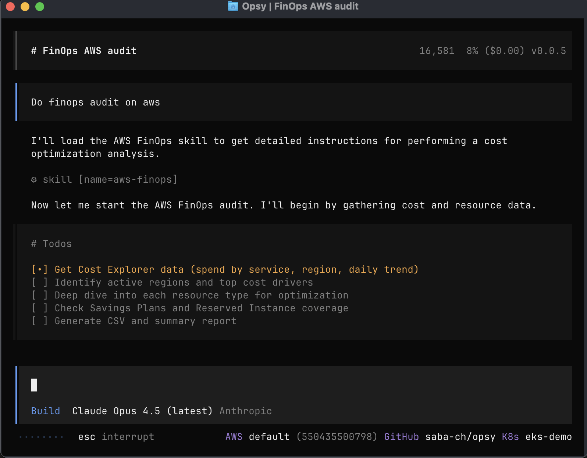

# AWS FinOps Skill

Analyzes AWS costs to find waste, optimize spending, and identify savings opportunities.

Identifies idle/underutilized resources, rightsizing candidates, unattached volumes, missing lifecycle policies, and Reserved Instance/Savings Plans coverage gaps.



## Installation

**Prerequisites:** [Install opsy first](../../README.md#installation)

**Add the skill:**

```bash
npx add-skill opsyhq/opsy --skill aws-finops
```

> **Note:** When prompted, choose to install under `claude/opencode` or `all agents`. Opsy will automatically pick it up.

Or manually add to `~/.opsy/opsy.jsonc`:

```json
{
  "instructions": [
    "https://raw.githubusercontent.com/opsyhq/opsy-cli/main/skills/aws-finops/SKILL.md"
  ]
}
```

## Usage

```bash
opsy
> find unused resources
```

Opsy automatically generates `finops-report-{account-id}-{date}.csv` with optimization opportunities and potential savings.

