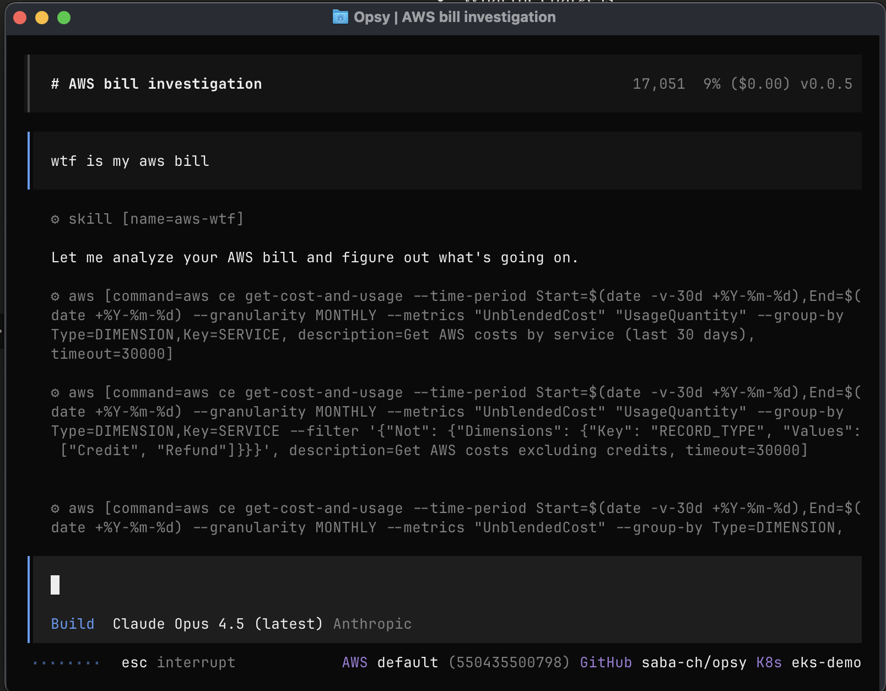

# AWS WTF Skill

Explains every charge on your AWS bill — what it is, why you're paying, and what resource caused it.



## Quick Start

1. **Install opsy:**
   ```bash
   curl -fsSL https://opsy.sh/install.sh | bash
   ```

2. **Add the skill:**
   ```bash
   npx add-skill opsyhq/opsy --skill aws-wtf
   ```
   
   Or manually add to `~/.opsy/opsy.jsonc`:
   ```json
   {
     "instructions": [
       "https://raw.githubusercontent.com/opsyhq/opsy-cli/main/skills/aws-wtf/SKILL.md"
     ]
   }
   ```
   
   > Note: When using `npx add-skill`, it automatically adds the skill to your Claude/OpenCode opsy config.

3. **Run opsy:**
   ```bash
   opsy
   ```

4. **Connect and select AWS:**
   ```
   > /connect    # Connect with existing Claude/OpenAI subscription
   > /aws        # Choose your AWS account
   ```

5. **Ask about your bill:**
   ```
   > wtf is my aws bill
   ```

Opsy will automatically:
- Query Cost Explorer (detects credits)
- Enumerate all resources across all regions
- Generate CSV report: `aws-wtf-{account-id}-{date}.csv`
- Show summary breakdown

## Output

**CSV Report** - Every charge with resource ARN, cost breakdown, and status (Billed/Free-Tier/Credit-Offset)

**Summary** - Actual usage vs credits, top charges, warnings

